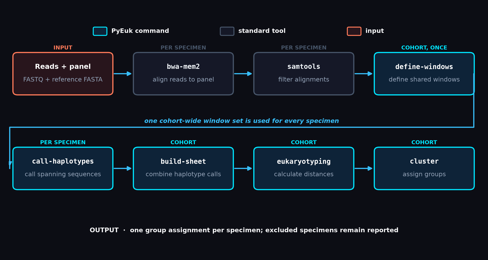
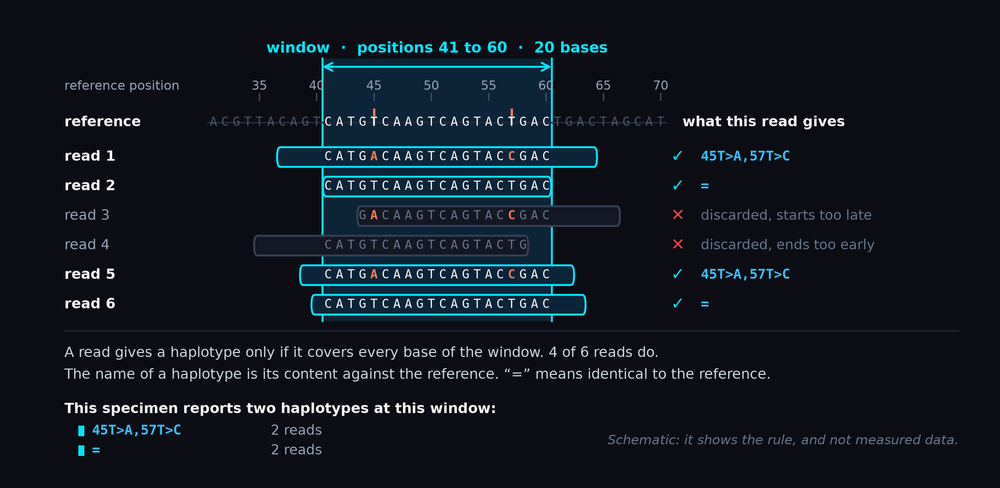
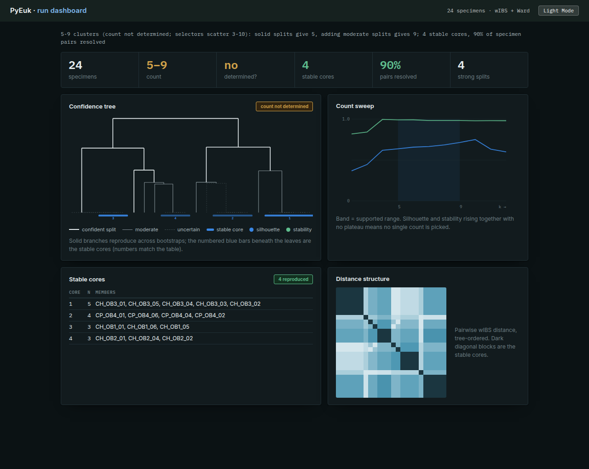
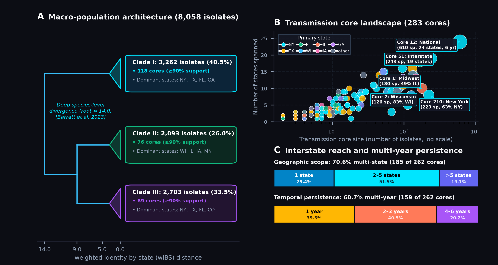

# PyEuk: A Tool Suite for Catalogue-Free Multilocus Typing


[](https://github.com/veg/pyeuk/releases/tag/v0.8.1)
[](https://bioconda.github.io/recipes/pyeuk/README.html)
[](https://www.python.org/)
[](LICENSE)
[]()

**PyEuk** is an end-to-end Python framework for unsupervised, catalogue-free multilocus microhaplotyping, pairwise genetic distance evaluation, and transmission cluster delineation in eukaryotic and microbial pathogens (including ***Cyclospora cayetanensis***, ***Plasmodium vivax***, ***Cryptosporidium***, and general amplicon panels).

Unlike classical bacterial MLST or centralized variant registries that founder when confronting eukaryotic parasites characterized by meiotic recombination, extensive polyclonality, copy-number variation, or missing primer schemes, PyEuk decouples typing from pre-existing allele catalogues:
* **Physical Within-Molecule Phasing**: Observes exact nucleotide sequences directly from continuous physical reads spanning target genomic windows end-to-end, preserving physical phase without statistical imputation.
* **Catalogue-Free & Coordinate-Free**: Discovers target amplicon panels *de novo* from raw read coverage peaks (`derive-panel`) and determines data-adaptive sub-amplicon analysis windows (`define-windows`) directly from sequencing data.
* **Dropout-Tolerant Genetic Distance Engine**: Computes continuous heterozygosity-weighted Identity-by-State (wIBS) genetic divergence strictly over mutually amplified loci, eliminating artificial distance spikes caused by PCR dropouts.
* **Stability-Guided Clustering & Sweeps**: Runs bootstrap partition stability sweeps to report confidence intervals (`[k_min, k_max]`) and reproducible transmission cores ($\ge 90\%$ bootstrap co-assignment) instead of forcing arbitrary cutoffs.
* **Accessible Ecosystem**: Available via [Bioconda](https://bioconda.github.io/recipes/pyeuk/README.html), pre-built [BioContainers](https://quay.io/repository/biocontainers/pyeuk), and companion Galaxy workflows via the [Intergalactic Workflow Commission (IWC)](https://iwc.galaxyproject.org/).

<p align="center">
  
</p>

*Figure 1: The two PyEuk analytical pipelines: (A) Standard amplicon workflow when target panels are known, and (B) Panel-Inference workflow reconstructing amplicon targets de novo from raw read coverage peaks when primer coordinates are missing.*

---

## 🚀 Core Capabilities

### 1. Catalogue-Free Microhaplotyping from Spanning Reads
* **Direct Physical Phase**: A read contributes to a haplotype call if and only if its alignment spans the target window interval $[pos_{\text{start}}, pos_{\text{end}}]$ end-to-end. Spanning reads directly distinguish co-infecting lineages from multi-mutant haplotypes without relying on statistical phasing.
* **Deterministic Variant Naming**: Mints content-derived, HGVS-like identifiers describing differences relative to reference coordinates (`45T>A,57T>C` denotes two differences; `=` denotes reference match). Identical sequences receive identical names without needing a central registry.
* **Mixture-Aware**: Preserves per-haplotype read frequencies within specimens, natively accommodating polyclonal mixtures and gene dosage variation.

<p align="center">
  
</p>

*Figure 2: The window microhaplotype unit of analysis. Only continuous sequencing reads spanning every base of the target window interval contribute a haplotype call. Differences relative to the reference sequence are encoded deterministically (e.g., `45T>A,57T>C` or `=` for reference match).*

### 2. Panel Discovery & Data-Adaptive Analysis Windows
* **De Novo Panel Inference (`pyeuk derive-panel`)**: When primer schemes or target coordinates are omitted from sequence repositories, `derive-panel` reconstructs panel FASTA targets *de novo* from contiguous coverage peaks against a draft genome assembly.
* **Data-Adaptive Window Placement (`pyeuk define-windows`)**: Automatically scans cohort BAMs to identify the widest spannable genomic intervals that clear coverage and spanning thresholds, avoiding primer artifacts and optimizing haplotype yield.

### 3. Locus-Dropout-Tolerant Genetic Distance Engine
* **Heterozygosity-Weighted IBS (wIBS)**: Evaluates pairwise genetic dissimilarity across multi-locus panels, weighting columns by population heterozygosity ($w = 2p(1-p)$) to prioritize balanced, outbreak-discriminating variants while attenuating rare singletons.
* **Pairwise-Complete Dropout Tolerance**: Computes distance strictly over mutually amplified loci, preventing PCR sequencing dropouts from triggering artificial distance spikes.
* **Positive Semi-Definite (PSD) Metric Projection**: Projects the distance Gram matrix to guarantee valid Euclidean metric geometry ($\lambda_{\text{min}} \ge 0.0$) for mathematically sound Ward hierarchical clustering.
* **High-Throughput Vectorization**: Evaluates pairwise distances across 8,000+ national surveillance isolates in under 4 minutes on a standard workstation.

### 4. Stability-Guided Clustering & Sweep Diagnostic
* **Reports a Range, Not a Forced Number**: Runs a bootstrap sweep across resampled loci and reports the range of cluster counts the data supports, a per-branch confidence tree (solid = reproduced, dashed = uncertain), and reproducible transmission cores ($\ge 90\%$ bootstrap co-assignment).
* **Dual Partitioning Regimes**:
  * `--cut count` (Outbreak Mode): Chooses optimal cluster count from the largest merge-height gap; ideal for bounded point-source traceback investigations.
  * `--cut distance` (Surveillance Mode): Cuts at a fixed dissimilarity threshold ($d$), returning sporadic background specimens as singletons—ideal for continuous open surveillance archives.
* **Lexicographical Tie-Breaking**: Completely deterministic cluster assignments for reproducible public health reporting.

### 5. Self-Contained Visual Reports (`pyeuk report`)
* **Standalone HTML Dashboards**: Converts sweep outputs into self-contained HTML dashboards with embedded inline SVG confidence trees, bootstrap stability charts, and pairwise distance heatmaps—with zero external JavaScript or CDN dependencies, safe for Galaxy embedding and air-gapped public health archives.
* **Multiple Flavors**: `dashboard` (dense surveillance overview), `clinical` (concise specimen-level verdict), and `narrative` (prose walkthrough of data support).
* **Live Interactive Demo**: An interactive demo report generated from a 24-specimen *Cryptosporidium* cohort is viewable at [`docs/example_report.html`](docs/example_report.html) (or online at [https://veg.github.io/pyeuk/example_report.html](https://veg.github.io/pyeuk/example_report.html)).

<p align="center">
  <a href="https://veg.github.io/pyeuk/example_report.html">
    
  </a>
  <br>
  <em>Figure: Standalone HTML report generated by <code>pyeuk report</code> showing confidence dendrogram (solid branches ≥ 90% bootstrap support), cluster stability curves, transmission core roster, and tree-ordered wIBS distance heatmap.</em>
</p>

---

## 🛠 Command Hierarchy

PyEuk provides a modular five-stage command hierarchy alongside upstream panel discovery and downstream visual reporting:

| Command | Stage | Input | Output | Description |
| :--- | :---: | :--- | :--- | :--- |
| **`pyeuk derive-panel`** | Pre-processing | Genome-mapped BAMs + Genome FASTA | `panel.fasta`, `panel.bed` | Reconstructs amplicon target panel *de novo* from raw read coverage peaks |
| **`pyeuk define-windows`** | Stage 1 | Panel FASTA + Cohort BAMs | `windows.bed` | Derives optimal sub-amplicon analysis windows across cohort read alignments |
| **`pyeuk call-haplotypes`** | Stage 2 | Specimen BAM + Panel FASTA + `windows.bed` | `calls/<specimen>.tsv` | Calls exact phased microhaplotypes per specimen from end-to-end spanning reads |
| **`pyeuk build-sheet`** | Stage 3 | `calls/` directory | `haplotype_data_sheet.txt` | Assembles multi-specimen calls into a binary presence/absence matrix |
| **`pyeuk eukaryotyping`** | Stage 4 | `haplotype_data_sheet.txt` | `distance_matrix.csv` | Computes pairwise locus-dropout-tolerant, weighted IBS genetic distances |
| **`pyeuk cluster`** | Stage 5 | `distance_matrix.csv` | `RESULTING_CLUSTERS_*.txt`, `*_SWEEP.json` | Performs hierarchical clustering with partition stability sweep and core detection |
| **`pyeuk report`** | Reporting | `*_SWEEP.json` + `distance_matrix.csv` | `report.html` | Renders a self-contained interactive visual HTML dashboard |

---

## 📦 Installation

### Option 1: Via Bioconda (Recommended)
```bash
conda install -c bioconda -c conda-forge pyeuk
```

### Option 2: Pre-built Container Images
Public container images with all dependencies (including `pysam`) are available via BioContainers:
```bash
# Docker
docker pull quay.io/biocontainers/pyeuk:0.8.1--pyhdfd78af_0

# Apptainer / Singularity
apptainer exec docker://quay.io/biocontainers/pyeuk:0.8.1--pyhdfd78af_0 pyeuk --help
```

### Option 3: From Source
```bash
git clone https://github.com/veg/pyeuk.git
cd pyeuk

# Core installation
pip install -e .

# With BAM/read-level amplicon processing dependencies (pysam):
pip install -e '.[amplicon]'

# With graphical HTML report heatmap rendering (Pillow):
pip install -e '.[report]'
```

---

## ⚡ Quickstart

### Standard Amplicon Workflow (BAMs to Transmission Cores)

```bash
# Optional: derive target panel de novo from coverage peaks if coordinates are unknown
pyeuk derive-panel ref_genome.fasta --bams bams/*.bam -o derived_panel.fasta

# 1. Define cohort-wide analysis windows from read alignments
pyeuk define-windows panel.fasta --bams bams/*.bam -o windows.bed

# 2. Call physically phased microhaplotypes for each specimen
mkdir -p calls
for bam in bams/*.bam; do
    sample=$(basename "$bam" .bam)
    pyeuk call-haplotypes --bam "$bam" --ref panel.fasta --specimen "$sample" \
        --bed windows.bed --out "calls/${sample}.tsv"
done

# 3. Assemble binary specimen-by-haplotype presence/absence matrix
pyeuk build-sheet calls/ output_matrix/

# 4. Calculate pairwise dropout-tolerant weighted IBS distances
pyeuk eukaryotyping -i output_matrix/haplotype_data_sheet.txt \
    -o distance_matrix.csv --wibs

# 5. Run hierarchical clustering with partition stability sweep
pyeuk cluster -m distance_matrix.csv -o clusters_detected/

# 6. Render visual HTML dashboard report
pyeuk report clusters_detected/*_SWEEP.json -o report.html --matrix distance_matrix.csv
```

---

### Alternative Ingestion Modes

PyEuk also supports rapid end-to-end execution on assembled contigs or legacy genotype calls:

```bash
# Ingest assembled FASTA contigs reference-free de novo
pyeuk run-all \
    -a example_data/cohort_contigs.fasta \
    --de-novo \
    -o ./de_novo_results

# Ingest directory of specimen call files (or .zip)
pyeuk run-all \
    -s example_data/specimens \
    -g example_data/gold_clusters.tsv \
    -o ./cyclospora_outbreak_results
```

---

## 📊 Empirical Surveillance & Clinical Validation Cohorts

PyEuk has been rigorously evaluated across surveillance and clinical validation cohorts spanning multiple eukaryotic pathogen species and epidemiological study designs:

| Cohort | BioProject | Panel | Loci | Specimens | Epidemiological Task | PyEuk Findings |
| :--- | :--- | :--- | :---: | :---: | :--- | :--- |
| ***Cyclospora* 2018 Outbreak** | PRJNA578931 | CDC 8-marker / Derived 6-amplicon | 7 / 6 | 153 | Resolving binary traceback distribution chains | Complete separation of Vendor A vs B (ARI = 0.9737 curated, 1.0000 derived; $[2, 2]$ decisive sweep). |
| ***Cyclospora* FDA TAS** | PRJNA1052691 | Derived 45-amplicon panel | 45 | 66 (99 archive) | Multi-cluster recovery without reference coordinates | Reconstructs 24 published outbreak clusters coordinate-free (ARI = 0.8408; 16 stable transmission cores). |
| ***Cyclospora* Surveillance Archive** | PRJNA578931 | 9 CDC genomic loci | 9 | 8,325 (8,058 retained) | Scaling transmission discovery across national archive | Delineates 283 reproducible cores ($\ge 90\%$ bootstrap) and separates tripartite species divergence (*Ccay* A, B, C; <4 min distance computation). |
| ***P. vivax* PvAmpSeq** | PRJNA1153071 | 11 microhaplotype markers | 11 | 277 | Continental divergence & clinical recurrence | Separates Peru vs Solomon Islands (ARI = 0.9712); classifies relapse vs reinfection with 92.9% accuracy (AUC = 0.9608). |
| ***P. vivax* CDC AmpliSeq** | PRJNA1092573 | 495 amplicons (444 retained) | 444 | 196 (169 retained) | Singleton-dominated open surveillance | Distance-mode cut ($d = 0.0869$) replicates published structure (ARI = 0.8063) while preserving background singletons. |

<p align="center">
  
</p>

*Figure 3: Unsupervised clustering and transmission core discovery across 8,058 national Cyclospora surveillance isolates. Bootstrap stability sweeps delineate 283 reproducible cores (≥90% co-assignment) spanning multi-state transmission clusters and capturing deep tripartite species divergence.*

### Computational Performance & Metric Rigor
* **Distance Engine Speedup**: Vectorized calculation over compressed sparse matrices processes N = 1,078 national surveillance specimens in **14.9 seconds** (vs 24.6 minutes in legacy scripts; **99.2× speedup**), scaling to 8,058 isolates in under 4 minutes on a standard 16-core workstation.
* **Amplicon Front-End Speedup**: Single-pass, thread-parallel window selection in `define-windows` delivers a **~10× speedup** on deep panels (e.g. 66-BAM *Cyclospora* cohort runtime reduced from ~2.4 hours to ~14 minutes, byte-identical output); `call-haplotypes` utilizes a deletion-neighborhood (SymSpell) index for fast, lossless denoise folding.
* **Positive Semi-Definite Metric Validity**: Gram matrix PSD projection guarantees $\lambda_{\text{min}} \ge 0.0$ across pairwise distance matrices, eliminating negative eigenvalue distortions and ensuring mathematically sound Ward hierarchical clustering (raw non-projected distances exported via `--no-psd`).

---

## 🌌 Galaxy Workflows

Companion Galaxy workflows for automated, reproducible end-to-end analysis are maintained and distributed through the **Intergalactic Workflow Commission (IWC)**:
* **Workflow Registry**: [https://iwc.galaxyproject.org/](https://iwc.galaxyproject.org/)
* Workflows integrate seamlessly into public Galaxy instances ([usegalaxy.org](https://usegalaxy.org), [usegalaxy.eu](https://usegalaxy.eu), [usegalaxy.org.au](https://usegalaxy.org.au)), allowing researchers to ingest raw SRA/FASTQ accessions, derive panels, call microhaplotypes, evaluate genetic distances, and view interactive HTML reports directly in the browser.

---

## 💻 Python API

```python
import pandas as pd
from pyeuk import (
    generate_haplotype_sheet,
    PyEukDistanceEngine,
    CyclosporaClusterFinder
)

# 1. Ingest specimen calls or generated sheet
sheet_df = generate_haplotype_sheet("example_data/specimens")

# 2. Compute Weighted IBS distance matrix (Heterozygosity w = 2p(1-p))
engine = PyEukDistanceEngine(weight_mode="heterozygosity", min_maf=0.0, project_psd=True)
clean_df = engine.process_haplotype_sheet(sheet_df)
dist_df = engine.compute_revised_wibs_matrix(clean_df)

# 3. Detect transmission clusters and evaluate partition stability
finder = CyclosporaClusterFinder()
clusters_df, k, thresh = finder.find_clusters(dist_df, output_dir="results")

print(f"Detected {k} outbreak clusters across {len(clusters_df)} specimens.")
```

---

## 🌐 Genomic Resources & Documentation

* 🧬 **UCSC BRC-Analytics Pathogen Portal**: [brc-analytics.org](https://brc-analytics.org/) — Reference genome tracks, gene models, and visual browser hubs for *Cyclospora cayetanensis* assemblies ([`GCA_002893315.1`](https://genome.ucsc.edu/cgi-bin/hgTracks?db=GCA_002893315.1) and [`GCA_002893485.1`](https://genome.ucsc.edu/cgi-bin/hgTracks?db=GCA_002893485.1)).
* 📄 **Technical Reports**: Detailed mathematical audits and validation documents are available in the [`docs/`](docs/) directory.

---

## 📄 Citation

If you use PyEuk in your research, please cite:

> Kosakovsky Pond SL, Callan D, Nekrutenko A. **PyEuk: a tool suite for catalogue-free multilocus typing.** (2026).

---

## 📄 License & Public Domain

This repository is in the public domain within the United States, and copyright and related rights in the work worldwide are waived through the [CC0 1.0 Universal public domain dedication](https://creativecommons.org/publicdomain/zero/1.0/). Code contributions are licensed under the Apache Software License v2.
